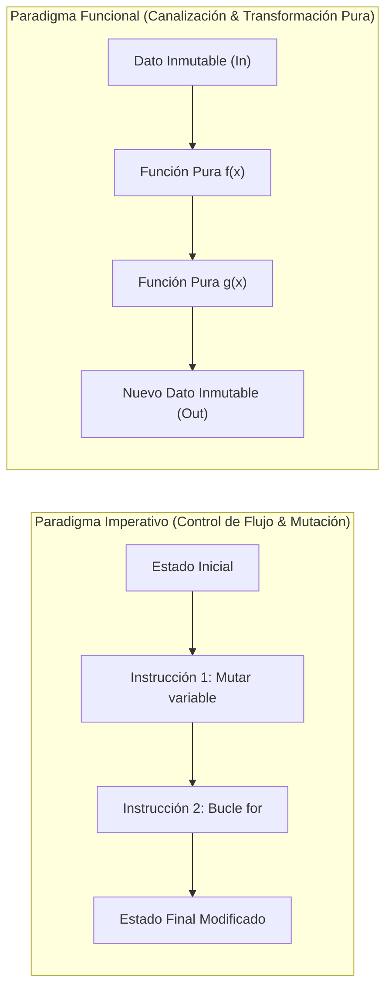
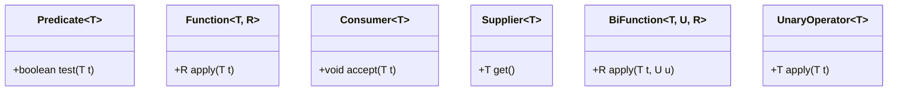

# 🧠 01: Fundamentos de la Programación Funcional en Java

> **Módulo:** Programación Funcional en Java  
> **Tema:** Paradigma declarativo, funciones puras, inmutabilidad, comparativa de paradigmas y justificación arquitectónica en el ecosistema Java.

---

## 📌 1. ¿Qué es la Programación Funcional (PF)?

La **Programación Funcional** es un paradigma de programación declarativo donde el cómputo se modela como la evaluación de **funciones matemáticas puras**, evitando el cambio de estado y los datos mutables.

A diferencia del paradigma imperativo tradicional (donde el desarrollador describe paso a paso **cómo** cambiar el estado de la memoria para llegar a un resultado), en la programación funcional se define **qué** transformaciones se deben aplicar a las entradas para producir las salidas deseadas.



### 🧬 Pilares Fundamentales de la Programación Funcional

#### 1. Inmutabilidad (Immutable State)
Una vez que un objeto o estructura de datos se crea, su estado **no puede cambiar jamás**. Si necesitas modificar un valor, se genera una nueva instancia con los datos transformados.
* **Ventaja Arquitectónica:** Elimina condiciones de carrera (*Race Conditions*) en entornos concurrentes, haciendo que el código sea inherentemente seguro en hilos (*Thread-Safe*).

#### 2. Funciones Puras (Pure Functions) y Determinismo
Una función es pura si cumple dos condiciones matemáticas estrictas:
1. **Determinismo:** Para el mismo conjunto de entradas, siempre retorna exactamente el mismo resultado.
2. **Cero Efectos Secundarios (*No Side Effects*):** No altera variables globales, no modifica sus parámetros, no escribe en disco ni realiza operaciones de E/S que alteren el entorno externo.

```java
// ❌ Función Impura (Depende de estado externo y produce efecto secundario)
int contadorGlobal = 0;
public int incrementarImpuro(int valor) {
    contadorGlobal += valor; // Modifica estado fuera de su alcance
    return contadorGlobal;
}

// ✅ Función Pura (Determinista, sin efectos secundarios, inmutable)
public int sumarPuro(int a, int b) {
    return a + b; // Para entradas iguales, salida idéntica garantizada
}
```

#### 3. Transparencia Referencial (Referential Transparency)
Cualquier llamada a una función pura puede ser reemplazada directamente por su valor resultante sin alterar el comportamiento del sistema. Esto habilita optimizaciones del compilador como la memorización (*Memoization*) y la evaluación paralela segura.

#### 4. Funciones como Ciudadanos de Primera Clase (First-Class Citizens)
Las funciones pueden:
* Ser asignadas a variables.
* Ser pasadas como argumentos a otras funciones.
* Ser retornadas como resultado de otras funciones.
* Ser almacenadas en estructuras de datos.

#### 5. Funciones de Orden Superior (Higher-Order Functions - HOF)
Son funciones que aceptan una o más funciones como parámetros o devuelven una función como resultado (por ejemplo, los métodos `.map()`, `.filter()`, `.flatMap()`).

---

## ⚖️ 2. Comparativa de Paradigmas

| Criterio | Programación Imperativa / Estructurada | Programación Orientada a Objetos (POO) | Programación Funcional (PF) |
| :--- | :--- | :--- | :--- |
| **Enfoque Principal** | Algoritmos y pasos secuenciales ("Cómo"). | Objetos que encapsulan estado y comportamiento. | Transformación de datos mediante funciones puras ("Qué"). |
| **Gestión del Estado** | Variables mutables globales y locales. | Estado mutable encapsulado en atributos de clase. | **Inmutable**. No existe mutación tras instanciar. |
| **Control de Flujo** | Bucles (`for`, `while`), condicionales (`if`, `switch`). | Polimorfismo, envío de mensajes entre objetos. | Recursividad, composición de funciones, canalizaciones (*Pipelines*). |
| **Concurrencia** | Compleja: requiere bloqueos manuales (`synchronized`, mutex). | Compleja: propensa a colisiones sobre estados compartidos. | **Trivial**: la inmutabilidad previene bloqueos y carreras. |
| **Testing** | Complejo por dependencias de estado temporal. | Requiere Mocks e inicialización de grafos de objetos. | **Muy simple**: solo validar entradas y salidas esperadas. |

### 🤝 El Enfoque Híbrido de Java Moderno
Java no es un lenguaje puramente funcional (como Haskell o Clojure). A partir de Java 8, Java adoptó un **enfoque multiparadigma híbrido**:
* Utiliza **POO** para modelar la arquitectura de dominio, tipos de datos y encapsulamiento (`Records`, `Classes`, `Interfaces`).
* Utiliza **Programación Funcional** para la lógica interna de negocio, procesamiento de colecciones, transformaciones asíncronas y operaciones de pipeline (`Lambdas`, `Streams`, `Optional`).

---

## 🚀 3. ¿Por qué usar Programación Funcional en Java?

### 1. Eliminación Radical del Código *Boilerplate* y Mayor Expresividad
Reduce bucles anidados y flags booleanos confusos a sentencias declarativas de lectura directa.

```java
// Enfoque Imperativo Clásico (Verboso, propenso a errores de índice o mutación)
List<String> emailsValidos = new ArrayList<>();
for (Usuario u : usuarios) {
    if (u.isActivo() && u.getEmail() != null) {
        if (u.getEdad() >= 18) {
            emailsValidos.add(u.getEmail().toLowerCase());
        }
    }
}

// Enfoque Declarativo / Funcional (Claro, modular, sin mutación intermedia)
List<String> emailsValidosFuncional = usuarios.stream()
    .filter(Usuario::isActivo)
    .filter(u -> u.getEmail() != null)
    .filter(u -> u.getEdad() >= 18)
    .map(u -> u.getEmail().toLowerCase())
    .toList();
```

### 2. Concurrencia y Paralelismo Seguro y Sin Fricción
Al no existir estado compartido mutable, paralelizar el procesamiento de 1 millón de registros requiere únicamente cambiar `.stream()` por `.parallelStream()`, delegando la distribución de hilos a `ForkJoinPool` sin necesidad de escribir código con `synchronized` ni semáforos.

### 3. Alineación con Principios SOLID y Clean Code
* **Single Responsibility (SRP):** Cada función lambda realiza exactamente una única transformación elemental.
* **Open/Closed (OCP):** Los métodos que reciben interfaces funcionales (como `Predicate` o `Function`) permiten extender el comportamiento de un componente sin modificar su implementación interna.
* **Dependency Inversion (DIP):** Dependemos de abstracciones funcionales en lugar de implementaciones concretas de algoritmos de iteración.

---

## 🧩 4. Interfaces Funcionales Clave (`java.util.function`)

Una **Interfaz Funcional** es cualquier interfaz que posea **un único método abstracto** (denominada técnicamente *SAM* - Single Abstract Method). Se decoran formalmente con la anotación `@FunctionalInterface`.



### Tabla Maestra de Interfaces Funcionales en Java

| Interfaz Funcional | Método Abstracto | Firma / Propósito | Caso de Uso Típico en Streams |
| :--- | :--- | :--- | :--- |
| `Predicate<T>` | `boolean test(T t)` | Recibe un dato y devuelve `true` o `false`. | Filtrar elementos con `.filter(p)`. |
| `Function<T, R>` | `R apply(T t)` | Recibe un tipo `T` y lo transforma a un tipo `R`. | Transformar objetos con `.map(f)`. |
| `Consumer<T>` | `void accept(T t)` | Consume un dato y no devuelve nada (efecto final). | Imprimir o registrar con `.forEach(c)`. |
| `Supplier<T>` | `T get()` | No recibe argumentos, produce/retorna un valor `T`. | Fábricas, valores por defecto con `orElseGet()`. |
| `UnaryOperator<T>` | `T apply(T t)` | Caso especial de `Function<T, T>` (mismo tipo de entrada y salida). | Incrementar, normalizar textos. |
| `BinaryOperator<T>` | `T apply(T t1, T t2)` | Recibe dos operandos del tipo `T` y retorna un `T`. | Operaciones de reducción acumulativa `.reduce()`. |
| `BiFunction<T, U, R>` | `R apply(T t, U u)` | Recibe dos parámetros de distinto tipo y retorna un tipo `R`. | Combinar dos entidades distintas. |
| `BiPredicate<T, U>` | `boolean test(T t, U u)` | Evalúa dos argumentos y retorna un booleano. | Comparar dos elementos. |
| `BiConsumer<T, U>` | `void accept(T t, U u)` | Consume dos argumentos sin retornar valor. | Iterar mapas con `.forEach((k, v) -> ...)`. |

---

## ⚠️ 5. Anti-patrones Comunes al Usar PF en Java

> [!WARNING]
> **1. Modificar variables externas (Efectos Secundarios Ocultos):**
> Las lambdas solo pueden capturar variables que sean `final` o *effectively final* (que no cambian tras su inicialización). Intentar saltarse esta regla mutando colecciones externas dentro de un `.map()` corrompe la pureza funcional y causa carreras en Streams paralelos.

> [!CAUTION]
> **2. Usar Streams para todo (Sobre-ingeniería):**
> Si solo necesitas recorrer 3 elementos para imprimir un log o realizar una asignación trivial, un `for-each` tradicional es más legible y genera menor *overhead* de asignación de objetos en el Garbage Collector.

> [!TIP]
> **3. Excepciones Comprobadas (*Checked Exceptions*) en Lambdas:**
> Los métodos de `java.util.function` no declaran cláusulas `throws`. Si tu código lanza una `Exception` comprobada (ej. `IOException`, `SQLException`), debes envolverla dentro de una `UncheckedException` (o `RuntimeException`) o encapsularla mediante una función envoltorio (*wrapper*).
