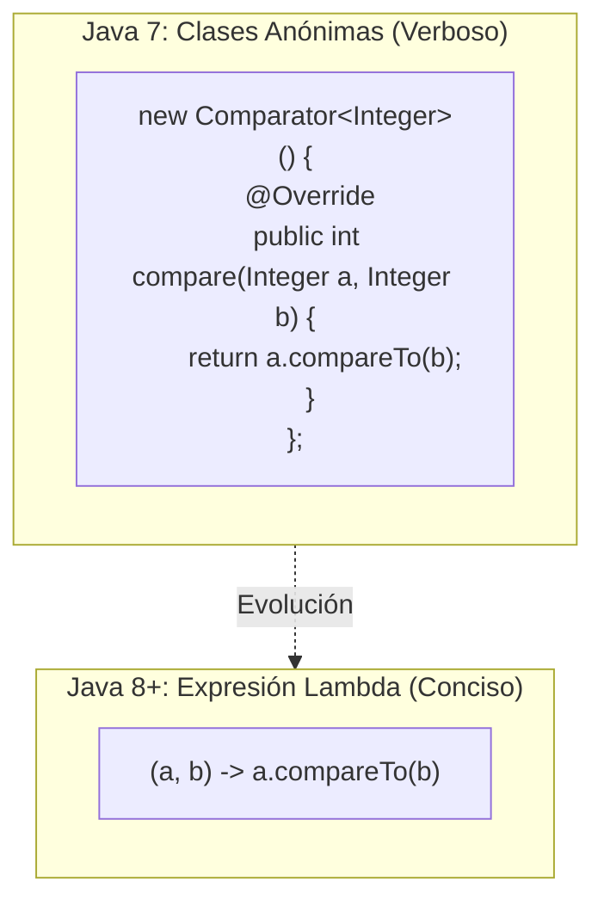
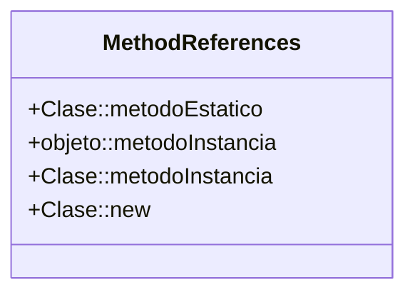
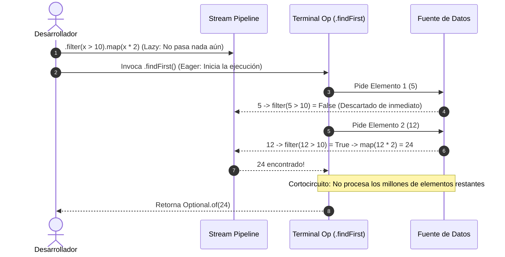

# ⚡ 02: Expresiones Lambda y Java Streams API

> **Módulo:** Programación Funcional en Java  
> **Tema:** Anatomía profunda de Lambdas, Referencias a Métodos (`::`), Arquitectura de Streams, Evaluación Perezosa (*Lazy Evaluation*), Pipelines y Paralelismo.

---

## 🎯 1. ¿Qué son las Expresiones Lambda?

Una **Expresión Lambda** es una función anónima (sin nombre, sin modificadores de acceso y sin clase explícita) que implementa de forma directa y ultra compacta el método único de una **Interfaz Funcional** (Single Abstract Method - SAM).

Introducidas en Java 8, eliminan por completo la necesidad de crear engorrosas **clases anónimas**.



### 🧬 Anatomía y Sintaxis de una Lambda

Una lambda consta de tres partes principales:

$$\underbrace{(param_1, param_2)}_{\text{Parámetros Formales}} \quad \longrightarrow \quad \underbrace{\{ \text{Cuerpo o Expresión} \}}_{\text{Lógica de Ejecución}}$$

```java
// 1. Sintaxis Completa (con tipos y bloque con return)
(Integer a, Integer b) -> {
    return a + b;
};

// 2. Inferencia de Tipos (el compilador deduce los tipos)
(a, b) -> {
    return a + b;
};

// 3. Expresión Única (sin llaves ni 'return' explícito)
(a, b) -> a + b;

// 4. Parámetro Único (sin necesidad de paréntesis)
nombre -> System.out.println(nombre);

// 5. Sin Parámetros (paréntesis obligatorios)
() -> System.out.println("Ejecutando proceso en background...");
```

### 🔒 Captura de Variables y `Effectively Final`
Una lambda puede acceder a variables locales del ámbito donde fue declarada únicamente si dichas variables son **inmutables** (`final`) o **efectivamente finales** (*effectively final*: su valor no se reasigna después de la inicialización).

```java
int puerto = 8080; // 'puerto' es effectively final
Runnable servidor = () -> System.out.println("Iniciando en puerto: " + puerto);

// ❌ Error de compilación si intentamos modificarla:
// puerto = 9090; // Rompe la condición de effectively final
```

---

## 🏷️ 2. Referencias a Métodos (`Method References` - `::`)

Son azúcares sintácticos aún más compactos y legibles que las lambdas cuando la función simplemente delega la llamada a un método existente.



| Tipo de Referencia | Sintaxis | Equivalente en Lambda | Ejemplo Práctico |
| :--- | :--- | :--- | :--- |
| **Método Estático** | `Clase::metodoEstatico` | `(x) -> Math.sqrt(x)` | `Math::sqrt` |
| **Método de Instancia de un Objeto** | `objeto::metodoInstancia` | `(x) -> System.out.println(x)` | `System.out::println` |
| **Método de Instancia de un Tipo Arbitrario** | `Clase::metodoInstancia` | `(s) -> s.toUpperCase()` | `String::toUpperCase` |
| **Constructor** | `Clase::new` | `() -> new ArrayList<>()` | `ArrayList::new` |

---

## 🌊 3. ¿Qué es un Java Stream?

Un **Stream** (`java.util.stream.Stream<T>`) **NO es una estructura de datos**. No almacena elementos ni modifica la fuente original de datos. 

> [!IMPORTANT]
> Un **Stream** es una **secuencia de elementos** que viaja a través de una **canalización computacional (*Pipeline*)**, soportando operaciones declarativas y agregadas (como filtrado, transformación, reducción y agrupación), procesadas de forma secuencial o paralela.

```mermaid
flowchart LR
    S["Fuente de Datos\n(List, Set, Array, I/O)"] --> OP1["Operación Intermedia 1\n.filter(p)"]
    OP1 --> OP2["Operación Intermedia 2\n.map(f)"]
    OP2 --> OP3["Operación Intermedia 3\n.sorted()"]
    OP3 --> TERM["Operación Terminal\n.collect(toList())"]
    TERM --> RES["Resultado Final / Objeto Inmutable"]

    style S fill:#e1f5fe,stroke:#0288d1
    style OP1 fill:#fff3e0,stroke:#f57c00
    style OP2 fill:#fff3e0,stroke:#f57c00
    style OP3 fill:#fff3e0,stroke:#f57c00
    style TERM fill:#e8f5e9,stroke:#388e3c
    style RES fill:#f3e5f5,stroke:#7b1fa2
```



### 🥊 Tabla Comparativa: `Collection` vs. `Stream`

| Característica | `Collection` (Estructura de Datos) | `Stream` (Canalización Funcional) |
| :--- | :--- | :--- |
| **Almacenamiento** | Almacena datos en memoria (RAM). | **No almacena datos**; transporta elementos bajo demanda. |
| **Mutabilidad** | Modifica o añade elementos directamente. | **Inmutable**: produce nuevas estructuras sin alterar la fuente. |
| **Evaluación** | **Eager (Ansiosa):** Todos los elementos se calculan de inmediato. | **Lazy (Perezosa):** Los elementos solo se procesan cuando se dispara una operación terminal. |
| **Reutilización** | Reutilizable múltiples veces. | **De un solo uso (*Single-Use*)**: un stream consumido queda cerrado. |
| **Iteración** | Externa (el programador escribe bucles `for`, `while`). | **Interna**: el runtime de Java gestiona el recorrido y optimizaciones. |

---

## ⚙️ 4. ¿Por qué el Stream es Funcional y por qué usarlo?

1. **Inmutabilidad y No Destructividad:** La fuente original (ej. una lista de base de datos) queda intacta tras el procesamiento.
2. **Evaluación Perezosa (*Lazy Evaluation*) & Fusión de Bucles (*Loop Fusion*):**
   Las operaciones intermedias no procesan toda la lista en cada paso. Java fusiona las operaciones en una sola pasada elemento por elemento.
3. **Optimización por Cortocircuito (*Short-Circuiting*):**
   Operaciones como `findFirst()`, `anyMatch()` o `limit(n)` detienen el cómputo en el instante en que se satisface la condición, sin recorrer el resto de la colección.
4. **Paralelismo Transparente (`parallelStream()`):**
   Permite aprovechar arquitecturas multi-núcleo dividiendo la carga de trabajo en el `ForkJoinPool` sin complejidad de sincronización manual.



---

## 🚦 5. Ciclo de Vida y Tipos de Operaciones en Streams

Una canalización de Stream (*Stream Pipeline*) consta estrictamente de 3 fases:

```
[ Fuente (Source) ] ➡️ [ 0 o N Operaciones Intermedias (Lazy) ] ➡️ [ 1 Operación Terminal (Eager) ]
```

### 1. Fuente (*Source*)
Origen de los datos: colecciones (`lista.stream()`), arreglos (`Arrays.stream(array)`), generadores (`Stream.iterate()`, `Stream.generate()`), rangos primitivos (`IntStream.range(1, 100)`), o líneas de archivo (`Files.lines(path)`).

### 2. Operaciones Intermedias (*Intermediate Operations - Lazy*)
Transforman un stream en otro stream. **No realizan ningún cómputo hasta que se invoca la operación terminal.**
* **Sin Estado (*Stateless*):** Procesan cada elemento de forma independiente (ej. `filter`, `map`, `flatMap`, `peek`). O(1) memoria auxiliar por elemento.
* **Con Estado (*Stateful*):** Requieren conocer elementos previos o todo el conjunto para emitir un resultado (ej. `sorted`, `distinct`, `limit`, `skip`). O(n) memoria auxiliar.

### 3. Operaciones Terminales (*Terminal Operations - Eager*)
Consumen el stream, ejecutan toda la cadena acumulada y producen un resultado concreto (una colección, un escalar, un booleano, un `Optional`) o un efecto secundario (como imprimir en consola). **Cierran el Stream para siempre.**

---

## 🚀 6. Streams Secuenciales vs. Streams Paralelos

```java
// Secuencial: Procesado por un único hilo en el orden del flujo
long totalSecuencial = transacciones.stream()
    .filter(t -> t.getMonto() > 1000)
    .count();

// Paralelo: Divide los datos en chunks usando ForkJoinPool.commonPool()
long totalParalelo = transacciones.parallelStream()
    .filter(t -> t.getMonto() > 1000)
    .count();
```

### 🎯 Criterio de Selección: ¿Cuándo usar `parallelStream()`?

| Usar `parallelStream()` ✅ | Evitar `parallelStream()` ❌ |
| :--- | :--- |
| Colecciones muy grandes ($N > 100,000$). | Colecciones pequeñas ($N < 10,000$, el overhead de crear hilos supera la ganancia). |
| Operaciones intensivas en CPU (cálculos matemáticos, hashing pesado). | Operaciones bloqueantes de Entrada/Salida (consultas a base de datos, llamadas HTTP). |
| Operaciones sin estado y totalmente independientes. | Operaciones con estado (`sorted()`, `distinct()`) o que dependen del orden estricto. |
| Estructuras fáciles de dividir en memoria (`ArrayList`, `Arrays`, `IntStream.range`). | Estructuras difíciles de dividir (`LinkedList`, `Stream.iterate`). |

---

## 💡 Key Takeaways de Arquitectura

1. **Los Streams son de un solo uso:** Si intentas reutilizar una variable `Stream` tras haber llamado a una operación terminal, Java lanzará un `IllegalStateException: stream has already been operated upon or closed`.
2. **La pereza (*Laziness*) es eficiencia:** Aprovecha las operaciones de cortocircuito para evitar procesamiento innecesario de colecciones gigantes.
3. **Evita efectos secundarios dentro de operaciones intermedias:** Un `.map()` o `.filter()` jamás debe alterar estados externos; reserva los efectos secundarios exclusivamente para la operación terminal (`.forEach()`).
