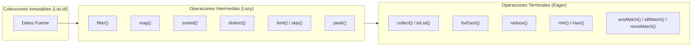

# 🛠️ Taller 01: Resolución y Guía Arquitectónica de Java Streams API

> **Autor:** Juan Diego Gaitán  
> **Módulo:** Semana 1 - Programación Funcional y Procesamiento de Flujos en Java  
> **Paquete:** `ResolucionTaller` (`semana01/taller01/src/ResolucionTaller`)

---

## 🎯 1. Visión General del Taller

El **Taller 01** comprende una suite de **16 ejercicios prácticos** diseñados para dominar el uso de la API de `java.util.stream.Stream`, expresiones lambda, referencias a métodos (`::`), evaluación perezosa (*Lazy Evaluation*) y reducción de colecciones en Java moderno.



---

## 📊 2. Matriz Maestra de Retos y Operaciones Utilizadas

| Archivo | Reto / Caso de Uso | Métodos de Stream Utilizados | Tipo de Operación | Interfaz Funcional (SAM) | Complejidad |
| :--- | :--- | :--- | :--- | :--- | :-: |
| [`reto1.java`](src/ResolucionTaller/reto1.java) | Filtrar estudiantes por letra inicial | `filter()`, `collect()` | Intermedia / Terminal | `Predicate<T>` | $O(N)$ |
| [`reto2.java`](src/ResolucionTaller/reto2.java) | Imprimir productos disponibles | `forEach()` | Terminal (Side Effect) | `Consumer<T>` | $O(N)$ |
| [`reto3.java`](src/ResolucionTaller/reto3.java) | Transformar ciudades a mayúsculas | `map()`, `collect()` | Intermedia / Terminal | `Function<T, R>` (`String::toUpperCase`) | $O(N)$ |
| [`reto4.java`](src/ResolucionTaller/reto4.java) | Sumatoria total de enteros | `reduce()` | Terminal (Folding) | `BinaryOperator<T>` (`Integer::sum`) | $O(N)$ |
| [`reto5.java`](src/ResolucionTaller/reto5.java) | Desduplicar y ordenar correos | `collect(TreeSet::new)` | Terminal (Mutable Red.) | `Supplier<Collection>` | $O(N \log N)$ |
| [`reto6.java`](src/ResolucionTaller/reto6.java) | Registrar transformaciones intermedias | `map()`, `peek()`, `collect()`| Intermedias / Terminal | `Consumer<T>` (Debug) | $O(N)$ |
| [`reto7.java`](src/ResolucionTaller/reto7.java) | Ordenamiento ascendente y descendente | `sorted()`, `sorted(reverseOrder)`| Intermedia (Stateful) | `Comparator<T>` | $O(N \log N)$ |
| [`reto8.java`](src/ResolucionTaller/reto8.java) | Eliminar códigos repetidos | `distinct()`, `collect()` | Intermedia (Stateful) | Basada en `equals/hashCode` | $O(N)$ |
| [`reto9.java`](src/ResolucionTaller/reto9.java) | Obtener Top 5 puntuaciones | `sorted()`, `limit()`, `collect()`| Intermedia (Cortocircuito)| `Comparator<T>` | $O(N \log N)$ |
| [`reto10.java`](src/ResolucionTaller/reto10.java)| Paginación / Saltar primeras 2 películas | `skip()`, `collect()` | Intermedia (Stateful) | Índice posicional | $O(N)$ |
| [`reto11.java`](src/ResolucionTaller/reto11.java)| Encontrar el precio más bajo | `min()`, `orElseThrow()` | Terminal (Reducción) | `Comparator<T>` (`naturalOrder`) | $O(N)$ |
| [`reto12.java`](src/ResolucionTaller/reto12.java)| Encontrar el salario más alto | `max()`, `orElse()` | Terminal (Reducción) | `Comparator<T>` (`naturalOrder`) | $O(N)$ |
| [`reto13.java`](src/ResolucionTaller/reto13.java)| Verificar existencia de al menos un par | `anyMatch()` | Terminal (Cortocircuito)| `Predicate<T>` | $O(1) \dots O(N)$ |
| [`reto14.java`](src/ResolucionTaller/reto14.java)| Validar que todas las notas sean $\ge 3.0$| `allMatch()` | Terminal (Cortocircuito)| `Predicate<T>` | $O(1) \dots O(N)$ |
| [`reto15.java`](src/ResolucionTaller/reto15.java)| Certificar ausencia del usuario `"root"` | `noneMatch()` | Terminal (Cortocircuito)| `Predicate<T>` (`"root"::equals`) | $O(1) \dots O(N)$ |
| [`retoFinal.java`](src/ResolucionTaller/retoFinal.java)| Pipeline completo con Java Records | `filter`, `map`, `sorted`, `peek`, `collect` | Multietapa Integral | Composición Funcional | $O(N \log N)$ |

---

## 🔍 3. Resumen y Explicación Técnica de las Operaciones Utilizadas

### A. Operaciones Intermedias (*Intermediate Operations - Lazy*)
Estas operaciones devuelven un nuevo `Stream` y **no se ejecutan inmediatamente**. Se evalúan bajo demanda únicamente cuando una operación terminal las solicita:

1. **`filter(Predicate<T>)` (Retos 1 y Final):**
   * *Cómo se usó:* `filter(e -> e.startsWith("A"))` y `filter(e -> e.nota() >= 3.0)`.
   * *Propósito:* Descartar elementos que no cumplan la condición booleana, reduciendo el volumen de datos en etapas tempranas.
2. **`map(Function<T, R>)` (Retos 3, 6 y Final):**
   * *Cómo se usó:* `map(String::toUpperCase)` y `map(e -> new Estudiante(...))`.
   * *Propósito:* Transformación $1:1$ de los elementos (de un tipo/forma a otra) sin alterar la colección original.
3. **`sorted()` y `sorted(Comparator<T>)` (Retos 7, 9 y Final):**
   * *Cómo se usó:* `sorted()`, `sorted(Comparator.reverseOrder())` y `sorted(Comparator.comparingDouble(...).reversed())`.
   * *Propósito:* Reordenar los elementos. Es una operación con estado (*Stateful*), por lo que requiere almacenar temporalmente los elementos antes de emitir el primer valor.
4. **`distinct()` (Reto 8):**
   * *Cómo se usó:* `codigos.stream().distinct()`.
   * *Propósito:* Filtrar duplicados basándose en `equals()` y `hashCode()`, manteniendo el orden original de inserción.
5. **`limit(long maxSize)` (Reto 9):**
   * *Cómo se usó:* `.limit(5)` para construir un ranking Top 5.
   * *Propósito:* Cortocircuitar el flujo tras procesar $K$ elementos.
6. **`skip(long n)` (Reto 10):**
   * *Cómo se usó:* `.skip(2)` para omitir los primeros elementos.
   * *Propósito:* Base técnica para paginación de resultados.
7. **`peek(Consumer<T>)` (Retos 6 y Final):**
   * *Cómo se usó:* `.peek(e -> System.out.println(...))`.
   * *Propósito:* Observabilidad y depuración (*Debugging*) en tránsito sin consumir el Stream.

---

### B. Operaciones Terminales (*Terminal Operations - Eager*)
Disparan el procesamiento de todo el pipeline, cierran el Stream y entregan el resultado:

1. **`collect(Collector)` (Retos 1, 3, 5, 6, 7, 8, 9, 10 y Final):**
   * *Cómo se usó:* `Collectors.toCollection(ArrayList::new)`, `Collectors.toCollection(TreeSet::new)` y `Collectors.toList()`.
   * *Propósito:* Acumular y materializar el flujo en estructuras de datos concretas (`List`, `TreeSet`, etc.).
2. **`forEach(Consumer<T>)` (Reto 2):**
   * *Cómo se usó:* `productos.forEach(p -> System.out.println(...))`.
   * *Propósito:* Ejecutar efectos secundarios controlados al final de una canalización.
3. **`reduce(identity, accumulator)` (Reto 4):**
   * *Cómo se usó:* `numeros.stream().reduce(0, Integer::sum)`.
   * *Propósito:* Plegado funcional asociativo para consolidar un flujo en un único escalar.
4. **`min()` y `max()` (Retos 11 y 12):**
   * *Cómo se usó:* `.min(Comparator.naturalOrder())` y `.max(Comparator.naturalOrder())`.
   * *Propósito:* Encontrar extremos numéricos envueltos de forma segura en `Optional<T>`.
5. **Predicados de Cortocircuito (`anyMatch`, `allMatch`, `noneMatch`) (Retos 13, 14 y 15):**
   * *Cómo se usaron:*
     * `anyMatch(n -> n % 2 == 0)`: Retorna `true` al encontrar el primer par.
     * `allMatch(nota -> nota >= 3.0)`: Valida aprobación unánime.
     * `noneMatch("root"::equals)`: Garantiza la ausencia estricta de un elemento con programación defensiva contra nulos.

---

## 🏆 4. Análisis Arquitectónico del Reto Final (`retoFinal.java`)

El reto final integra un pipeline completo de 5 fases procesando un `record Estudiante(String nombre, double nota)`:

```
[ Fuente Inmutable: 6 Estudiantes ]
       ⬇️ 1. filter(nota >= 3.0)           [Descarta 2 estudiantes no aprobados]
[ 4 Estudiantes Aprobados ]
       ⬇️ 2. map(nombre.toUpperCase())      [Transforma a nuevo Record inmutable]
[ 4 Estudiantes con Mayúsculas ]
       ⬇️ 3. sorted(nota.reversed())        [Ordena en memoria O(N log N)]
[ 4 Estudiantes Ordenados Descendente ]
       ⬇️ 4. peek(log consola)              [Trazabilidad y diagnóstico]
[ Observabilidad de Ejecución ]
       ⬇️ 5. collect(Collectors.toList())   [Materialización en Lista]
[ Resultado: [LAURA(4.8), ANA(4.5), ANDRES(3.9), CARLOS(3.2)] ]
```

### 💡 Buenas Prácticas Aplicadas en el Taller
1. **Filtro temprano (*Fail-Fast / Early Filtering*):** Filtrar antes de ordenar reduce el costo temporal de $O(N \log N)$ sobre toda la colección a $O(K \log K)$ sobre el subconjunto válido.
2. **Inmutabilidad con Records:** Uso de estructuras inmutables para transportar datos sin efectos colaterales.
3. **Referencias a métodos (`::`):** Reducción de código mediante `String::toUpperCase`, `Integer::sum`, `"root"::equals` y `TreeSet::new`.
4. **Seguridad contra Nulos (*Null-Safety*):** Uso de `Optional.orElseThrow()` y `Optional.orElse()` para un manejo determinista de colecciones potencialmente vacías.
