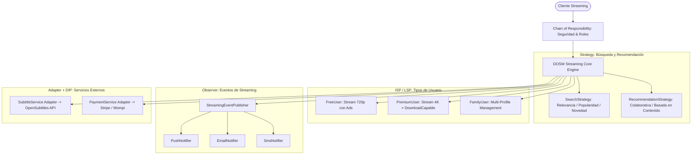

# 🏛️ SEMANA No 3 — Taller de Refuerzo #3: SOLID y Patrones de Diseño en Casos Reales

> **DOSW COMPANY** — *Taller de Refuerzo #3: SOLID & Patrones de Diseño*  
> **Escuela Colombiana de Ingeniería Julio Garavito**  
> **Asignatura:** Desarrollo y Operaciones de Software (DOSW)  
> **Modalidad:** Individual  
> **Tecnología:** Java 21+ / Java 25 · Clean Code · SOLID · DRY · GoF Design Patterns · Agile/XP  
> **Ubicación:** `semana03/`

---

## 👨‍💻 Datos del Estudiante
- **Nombre:** Nadia
- **Asignatura:** DOSW
- **Semana:** 03

---

## 📋 Tabla de Contenidos
1. [Referencia Rápida — Principios SOLID](#-referencia-rápida--principios-solid)
2. [Parte I — Identificando Violaciones a SOLID (Casos #1 al #5)](#-parte-i--identificando-violaciones-a-solid)
   - [Caso #1: El Sistema de Facturación](#1-el-sistema-de-facturación)
   - [Caso #2: La Aplicación de Transporte](#2-la-aplicación-de-transporte)
   - [Caso #3: El Sistema de Notificaciones](#3-el-sistema-de-notificaciones)
   - [Caso #4: El Cajero Inteligente (Incluye Preguntas Guía)](#4-el-cajero-inteligente)
   - [Caso #5: El Sistema de Pagos](#5-el-sistema-de-pagos)
3. [Parte II — ¿Qué Principio Debería Aplicarse? (Casos #6 al #10)](#-parte-ii--qué-principio-debería-aplicarse)
   - [Caso #6: E-Commerce con Múltiples Medios de Pago](#6-e-commerce-con-múltiples-medios-de-pago)
   - [Caso #7: Plataforma de Streaming — Tipos de Usuario](#7-plataforma-de-streaming--tipos-de-usuario)
   - [Caso #8: Sistema de Sensores IoT](#8-sistema-de-sensores-iot)
   - [Caso #9: Aplicación Bancaria — Interfaz Monolítica](#9-aplicación-bancaria--interfaz-monolítica)
   - [Caso #10: CourseManager — La Clase Que Lo Hace Todo](#10-coursemanager--la-clase-que-lo-hace-todo)
4. [Parte III — Identificando Patrones de Diseño (Casos #11 al #18)](#-parte-iii--identificando-patrones-de-diseño)
   - [Caso #11: El Único Administrador (Singleton)](#11-el-único-administrador)
   - [Caso #12: Múltiples Formas de Pago (Strategy)](#12-múltiples-formas-de-pago)
   - [Caso #13: Generación de Reportes (Factory Method)](#13-generación-de-reportes)
   - [Caso #14: Sistema de Eventos — Cambio de Estado de Pedido (Observer)](#14-sistema-de-eventos--cambio-de-estado-de-pedido)
   - [Caso #15: Integración con el Banco Antiguo (Adapter)](#15-integración-con-el-banco-antiguo)
   - [Caso #16: Mensajes en una App de Chat (Bridge)](#16-mensajes-en-una-app-de-chat)
   - [Caso #17: Construcción de Vehículos Configurables (Builder)](#17-construcción-de-vehículos-configurables)
   - [Caso #18: Sistema de Seguridad — Validaciones en Cadena (Chain of Responsibility)](#18-sistema-de-seguridad--validaciones-en-cadena)
5. [Parte IV — Casos Desafío](#-parte-iv--casos-desafío)
   - [Caso #19: DOSW Streaming — Plataforma de Streaming Combinada](#19-dosw-streaming--la-plataforma-de-streaming)
   - [Caso #20: Reto Bonus (+0.5 puntos) — Análisis de Sistema Real (Spotify)](#-20-reto-bonus-05-puntos--análisis-de-spotify)
6. [Estructura del Proyecto y Verificación](#-estructura-del-proyecto-y-verificación)
7. [Checklist de Criterios de Evaluación](#-checklist-de-criterios-de-evaluación)

---

## 🧭 Referencia Rápida — Principios SOLID

| Sigla | Principio | Definición Técnica y Axioma de Diseño |
| :---: | :--- | :--- |
| **S** | **Single Responsibility Principle (SRP)** | *Una clase debe tener una, y solo una, razón para cambiar.* Cada módulo encapsula un único actor o contexto de negocio. |
| **O** | **Open / Closed Principle (OCP)** | *Las entidades de software deben estar abiertas para su extensión, pero cerradas para su modificación.* Extender mediante polimorfismo/abstracción sin tocar código ya probado. |
| **L** | **Liskov Substitution Principle (LSP)** | *Los objetos de un programa deben ser reemplazables por instancias de sus subtipos sin alterar la corrección del programa.* Los subtipos no deben romper pre/postcondiciones ni invariantes del tipo base. |
| **I** | **Interface Segregation Principle (ISP)** | *Ningún cliente debe ser forzado a depender de métodos que no utiliza.* Favorecer interfaces pequeñas, de grano fino y altamente cohesivas sobre interfaces monolíticas. |
| **D** | **Dependency Inversion Principle (DIP)** | *Los módulos de alto nivel no deben depender de módulos de bajo nivel; ambos deben depender de abstracciones.* Las abstracciones no deben depender de detalles; los detalles deben depender de abstracciones. |

---

## 🔍 PARTE I — IDENTIFICANDO VIOLACIONES A SOLID

---

### #1 El Sistema de Facturación

```java
public class InvoiceManager {
    public void calculateTaxes() { }        // lógica tributaria
    public void generateInvoicePDF() { }     // formato de presentación
    public void sendInvoiceByEmail() { }     // canal de comunicación
    public void saveInvoiceDatabase() { }    // persistencia
}
```

* ⚠️ **Principio Violado:** **SRP (Single Responsibility Principle - Principio de Responsabilidad Única)**
* 🧠 **¿Por qué?:**
  `InvoiceManager` concentra cuatro ejes de cambio completamente dispares pertenecientes a diferentes actores organizacionales:
  1. **Área Contable/Fiscal:** Cambio en las tarifas o reglas impositivas (`calculateTaxes`).
  2. **Diseño/UX:** Modificación en las plantillas o librerías de renderizado visual (`generateInvoicePDF`).
  3. **Infraestructura/Comunicaciones:** Cambio de proveedor SMTP/SendGrid (`sendInvoiceByEmail`).
  4. **DBA/Persistencia:** Migración de SQL a NoSQL o cambios de esquema (`saveInvoiceDatabase`).
  Cualquier alteración en uno de estos dominios obliga a recompilar, re-probar y re-desplegar una clase monolítica con alto riesgo de regresiones cruzadas (*God Class anti-pattern*).

* 🛠️ **Solución Propuesta (Clean Architecture / XP):**
  Desacoplar la clase en componentes con responsabilidad atómica:
  - [`Invoice`](src/parte1_solid/caso1_facturacion/Invoice.java): Modelo de dominio inmutable (Record).
  - [`TaxCalculator`](src/parte1_solid/caso1_facturacion/TaxCalculator.java): Encapsula exclusivamente las reglas impositivas.
  - [`InvoicePdfGenerator`](src/parte1_solid/caso1_facturacion/InvoicePdfGenerator.java): Responsable exclusivo del layout y generación binaria PDF.
  - [`InvoiceEmailSender`](src/parte1_solid/caso1_facturacion/InvoiceEmailSender.java): Gestiona el canal de mensajería electrónica.
  - [`InvoiceRepository`](src/parte1_solid/caso1_facturacion/InvoiceRepository.java): Abstrae la persistencia en base de datos.
  - [`InvoiceService`](src/parte1_solid/caso1_facturacion/InvoiceService.java): Caso de uso orquestador.

---

### #2 La Aplicación de Transporte

```java
class Vehicle {
    public void move() { } // contrato: todo vehículo puede moverse
}
class Car extends Vehicle { } // ✓ OK
class Bicycle extends Vehicle { } // ✓ OK
class Airplane extends Vehicle { } // ✓ OK
class Boat extends Vehicle {
    @Override
    public void move() {
        throw new UnsupportedOperationException(); // ✗ ROMPE EL CONTRATO
    }
}
```

* ⚠️ **Principio Violado:** **LSP (Liskov Substitution Principle - Principio de Sustitución de Liskov)**
* 🧠 **¿Por qué?:**
  `Boat` hereda de `Vehicle`, pero al invocar `move()` lanza una excepción runtime `UnsupportedOperationException`. Esto rompe el contrato de comportamiento esperado por cualquier cliente polimórfico que itere sobre colecciones `List<Vehicle>`. Según el axioma de Barbara Liskov, una subclase no puede fortalecer las precondiciones ni debilitar las postcondiciones, ni cambiar el contrato semántico lanzando excepciones inesperadas para operaciones válidas en la superclase.

* 🛠️ **Solución Propuesta:**
  1. Si un barco puede moverse (navegar), la implementación de `move()` debe realizar la acción correspondiente a su medio acuático sin arrojar excepciones.
  2. Si existen diferencias fundamentales de capacidades entre medios (terrestre, aéreo, marítimo), se segregan contratos de interfaz o capacidades de dominio específicas ([`Movable`](src/parte1_solid/caso2_transporte/Movable.java), [`Boat`](src/parte1_solid/caso2_transporte/Boat.java), [`Car`](src/parte1_solid/caso2_transporte/Car.java)), garantizando que todo `Movable` ejecute su desplazamiento sin fallas inesperadas de tipado.

---

### #3 El Sistema de Notificaciones

```java
public class NotificationService {
    public void sendNotification(String type) {
        if (type.equals("EMAIL")) { /* lógica email */ }
        if (type.equals("SMS")) { /* lógica SMS */ }
        if (type.equals("WHATSAPP")) { /* lógica WhatsApp */ }
        // para agregar PUSH o TELEGRAM: abrir y modificar esta clase
    }
}
```

* ⚠️ **Principio Violado:** **OCP (Open/Closed Principle - Principio Abierto/Cerrado)**
* 🧠 **¿Por qué?:**
  La clase no está cerrada para modificación. Cada vez que el negocio requiere integrar un nuevo canal (Telegram, Push, Slack, Discord), es mandatorio abrir el archivo fuente `NotificationService.java`, alterar el método `sendNotification` e introducir nuevas bifurcaciones condicionales `if-else` / `switch`. Esto incrementa la complejidad ciclomática, viola la cohesión y expone a regresiones los canales existentes ya validados en producción.

* 🛠️ **Solución Propuesta:**
  Aplicar polimorfismo con el patrón Strategy:
  - Definir la abstracción [`NotificationChannel`](src/parte1_solid/caso3_notificaciones/NotificationChannel.java) con métodos `getChannelType()` y `send(recipient, message)`.
  - Crear implementaciones concretas independientes: [`EmailNotificationChannel`](src/parte1_solid/caso3_notificaciones/EmailNotificationChannel.java), [`SmsNotificationChannel`](src/parte1_solid/caso3_notificaciones/SmsNotificationChannel.java), [`WhatsAppNotificationChannel`](src/parte1_solid/caso3_notificaciones/WhatsAppNotificationChannel.java), [`PushNotificationChannel`](src/parte1_solid/caso3_notificaciones/PushNotificationChannel.java), [`TelegramNotificationChannel`](src/parte1_solid/caso3_notificaciones/TelegramNotificationChannel.java).
  - [`NotificationService`](src/parte1_solid/caso3_notificaciones/NotificationService.java) recibe y registra dinámicamente canales mediante inyección de dependencias, quedando 100% cerrado a modificaciones.

---

### #4 El Cajero Inteligente

```java
public interface SmartATM {
    void withdraw();                // cajero básico: ✓
    void deposit();                 // cajero básico: ✗ no soporta
    void printStatement();          // cajero básico: ✗ no soporta
    void biometricValidation();     // cajero básico: ✗ no tiene lector
    void cryptocurrencyTransfer();  // cajero básico: ✗ nunca tendrá
}
```

* ⚠️ **Principio Violado:** **ISP (Interface Segregation Principle - Principio de Segregación de Interfaces)**
* 🧠 **¿Por qué?:**
  `SmartATM` es una "interfaz gorda" (*fat interface*) o monolítica. Obliga a implementaciones de hardware básico como `BasicATM` a implementar métodos que no soportan ni necesitan, forzándolos a dejar cuerpos vacíos (*no-op*) o lanzar excepciones en tiempo de ejecución, lo que a su vez contamina el código y desencadena violaciones secundarias a LSP.

#### 📌 PREGUNTAS GUÍA RESUELTAS:

1. **¿Cuántas interfaces más cohesivas propondría en lugar de SmartATM? Nómbrelas y asígneles sus métodos.**
   Se proponen **5 interfaces de rol altamente cohesivas**:
   - [`Withdrawable`](src/parte1_solid/caso4_cajero/Withdrawable.java): `void withdraw(double amount);`
   - [`Depositable`](src/parte1_solid/caso4_cajero/Depositable.java): `void deposit(double amount);`
   - [`StatementPrintable`](src/parte1_solid/caso4_cajero/StatementPrintable.java): `void printStatement();`
   - [`BiometricCapable`](src/parte1_solid/caso4_cajero/BiometricCapable.java): `boolean validateBiometrics(String biometricToken);`
   - [`CryptoTransferable`](src/parte1_solid/caso4_cajero/CryptoTransferable.java): `void transferCrypto(String walletAddress, double amountInCrypto);`

2. **¿Qué problemas concretos genera que BasicATM tenga que implementar cryptocurrencyTransfer()?**
   - **Acoplamiento innecesario:** Obliga a importar dependencias y librerías criptográficas que el hardware básico jamás usará.
   - **Fragilidad y falsas expectativas:** Un cliente que invoque el método en un `BasicATM` creerá erróneamente que la operación es viable hasta que falle en runtime (*Runtime Exception* o silencio peligroso).
   - **Violación de contratos:** Degrada la mantenibilidad y rompe el principio de menor sorpresa (*Principle of Least Astonishment*).

3. **Si se agrega un cajero multidivisa, ¿qué interfaz(ces) debería implementar? ¿Tendría que tocar BasicATM?**
   - El cajero multidivisa implementa [`Withdrawable`](src/parte1_solid/caso4_cajero/Withdrawable.java) y una nueva interfaz específica [`MultiCurrencyCapable`](src/parte1_solid/caso4_cajero/MultiCurrencyCapable.java) con el método `dispenseForeignCurrency(currencyCode, amount)`.
   - **No se toca `BasicATM` en lo absoluto.** `BasicATM` permanece aislado e inalterado en su propio archivo fuente.

4. **¿Cómo el ISP facilita agregar nuevas funcionalidades sin romper implementaciones existentes?**
   Al descomponer el comportamiento en contratos modulares e independientes, las nuevas funcionalidades se incorporan creando nuevas interfaces o implementándolas solo en las clases que poseen el hardware/soporte necesario. Las clases preexistentes no sufren modificaciones en su firma, no requieren recompilación ni sufren efectos colaterales.

---

### #5 El Sistema de Pagos

```java
public class PaymentProcessor {
    // Dependencia hardcodeada: acoplamiento total
    private PaypalGateway gateway = new PaypalGateway();
    public void processPayment(double amount) {
        gateway.pay(amount); // imposible cambiar sin tocar esta clase
    }
}
```

* ⚠️ **Principio Violado:** **DIP (Dependency Inversion Principle - Principio de Inversión de Dependencias)**
* 🧠 **¿Por qué?:**
  El módulo de alto nivel (`PaymentProcessor`, que gestiona la lógica de negocio del flujo de pago) está acoplado de forma rígida y directa a una concreción de bajo nivel (`PaypalGateway`) instanciándola con `new`. Esto impide sustituir PayPal por Stripe, Wompi o MercadoPago en tiempo de ejecución o inyectar *test doubles* (mocks/stubs) para pruebas unitarias automatizadas.

* 🛠️ **Solución Propuesta:**
  - Crear la abstracción [`PaymentGateway`](src/parte1_solid/caso5_pagos/PaymentGateway.java).
  - Implementaciones concretas de bajo nivel: [`PaypalGateway`](src/parte1_solid/caso5_pagos/PaypalGateway.java), [`StripeGateway`](src/parte1_solid/caso5_pagos/StripeGateway.java), [`WompiGateway`](src/parte1_solid/caso5_pagos/WompiGateway.java), [`MercadoPagoGateway`](src/parte1_solid/caso5_pagos/MercadoPagoGateway.java).
  - [`PaymentProcessor`](src/parte1_solid/caso5_pagos/PaymentProcessor.java) recibe la interfaz `PaymentGateway` mediante inyección por constructor (*Constructor Dependency Injection*).

---

## ✅ PARTE II — ¿QUÉ PRINCIPIO DEBERÍA APLICARSE?

| # | Caso y Escenario | Principio a Aplicar | Beneficio Clave Fundamentado |
| :---: | :--- | :---: | :--- |
| **#6** | **E-Commerce con Múltiples Medios de Pago**<br>Constantemente aparecen nuevos medios de pago (criptomonedas, PSE, Nequi) y se teme romper el flujo de compra existente. | **OCP**<br>*(Open / Closed Principle)* | **Extensibilidad segura sin regresiones:** Permite enchufar nuevos procesadores de pago como nuevas clases independientes que implementan el contrato de pago sin alterar ni poner en riesgo el código crítico del checkout. |
| **#7** | **Plataforma de Streaming — Tipos de Usuario**<br>Usuarios gratuitos, premium y familiares comparten el flujo de reproducción, pero premium descarga, familiares crean perfiles y gratuitos tienen límites. | **LSP + ISP**<br>*(Liskov Substitution & Interface Segregation)* | **Sustituibilidad polimórfica y contratos limpios:** El motor central de reproducción trata a cualquier usuario de forma uniforme sin verificaciones de tipo (`instanceof`), segregando las capacidades avanzadas (descarga, perfiles) a interfaces especializadas. |
| **#8** | **Sistema de Sensores IoT**<br>Sensores transmiten por MQTT, HTTP o WebSocket. El sistema central debe recibir datos agnóstico al protocolo de transporte y permitir futuros protocolos (CoAP, LoRaWAN). | **DIP**<br>*(Dependency Inversion Principle)* | **Desacoplamiento total del transporte:** El motor central de procesamiento depende exclusivamente de un contrato abstracto de ingesta de telemetría (`DataIngestionChannel`), aislando las reglas de negocio de los detalles de red y protocolos físicos. |
| **#9** | **Aplicación Bancaria — Interfaz Monolítica**<br>`BankUser` tiene más de 30 métodos. Clientes usan 10, gerentes 15 y auditores 5. Cambiar un método de gerentes fuerza recompilar a clientes y auditores. | **ISP**<br>*(Interface Segregation Principle)* | **Aislamiento de módulos y recompilación cero:** Se divide `BankUser` en interfaces de rol (`CustomerOperations`, `ManagerOperations`, `AuditorOperations`). Modificaciones en operaciones gerenciales no afectan ni obligan a recompilar a clientes ni auditores. |
| **#10** | **CourseManager — La Clase Que Lo Hace Todo**<br>`CourseManager` crea cursos, envía correos, genera certificados, calcula estadísticas y administra profesores. Modificar certificados genera colisión con estadísticas. | **SRP**<br>*(Single Responsibility Principle)* | **Independencia de equipos y alta cohesión:** Se segregan responsabilidades en clases atómicas (`CourseAdmin`, `CertificateGenerator`, `EmailService`, `AnalyticsEngine`). Marketing y Analítica trabajan en paralelo sin conflictos de fusión (*merge conflicts*) ni efectos secundarios. |

---

## 🧩 PARTE III — IDENTIFICANDO PATRONES DE DISEÑO

---

### #11 El Único Administrador
* 🏷️ **Categoría GoF:** **Creacional**
* 🎯 **Patrón:** **Singleton** (Implementado mediante *Bill Pugh Singleton Holder*)
* 🧠 **¿Por qué?:**
  La aplicación requiere un punto centralizado y global para acceder al estado de configuración del sistema. Permitir múltiples instancias generaría discrepancias de estado entre módulos (ej. unos leyendo un timeout desactualizado). El patrón garantiza la existencia de una y solo una instancia en memoria accesible uniformemente.
* ⚙️ **¿Cómo se usa?:**
  Constructor privado para impedir instanciación externa (`new`), variable estática privada para almacenar la instancia y método de acceso global estático y *thread-safe* (`getInstance()`).
* 📝 **Resumen del Patrón:**
  Garantiza que una clase tenga una única instancia en toda la JVM y proporciona un punto de acceso global a ella con inicialización perezosa (*lazy loading*).
* 💻 **Código en el repositorio:** [`ConfigurationManager.java`](src/parte3_patrones/caso11_singleton/ConfigurationManager.java)

---

### #12 Múltiples Formas de Pago
* 🏷️ **Categoría GoF:** **Comportamiento (Behavioral)**
* 🎯 **Patrón:** **Strategy**
* 🧠 **¿Por qué?:**
  El flujo transaccional del carrito (selección, validación, confirmación) es idéntico e invariable, pero el algoritmo para ejecutar el cobro cambia radicalmente según el método elegido (Tarjeta de Crédito, PSE, PayPal, Nequi). Strategy encapsula cada algoritmo en clases intercambiables eliminando bloques condicionales extensos.
* ⚙️ **¿Cómo se usa?:**
  Se define una interfaz común `PaymentStrategy` implementada por cada algoritmo de pago. El cliente `CheckoutService` recibe la estrategia por inyección o la intercambia en runtime mediante un setter `setPaymentStrategy()`.
* 📝 **Resumen del Patrón:**
  Define una familia de algoritmos, encapsula cada uno de ellos y los hace intercambiables. Permite que el algoritmo varíe independientemente de los clientes que lo utilizan.
* 💻 **Código en el repositorio:** [`CheckoutService.java`](src/parte3_patrones/caso12_strategy/CheckoutService.java) · [`PaymentStrategy.java`](src/parte3_patrones/caso12_strategy/PaymentStrategy.java)

---

### #13 Generación de Reportes
* 🏷️ **Categoría GoF:** **Creacional**
* 🎯 **Patrón:** **Factory Method / Simple Factory**
* 🧠 **¿Por qué?:**
  El cliente que solicita la exportación de información solo necesita obtener un objeto que cumpla el contrato `Report` para invocar `export()`, sin acoplarse a los detalles específicos de construcción de un archivo binario PDF, una hoja de cálculo Excel XLSX o un plano CSV.
* ⚙️ **¿Cómo se usa?:**
  Una interfaz común `Report` es implementada por `PdfReport`, `ExcelReport` y `CsvReport`. Una clase fábrica `ReportFactory` encapsula la lógica de instanciación devolviendo la instancia adecuada según el parámetro o configuración solicitada.
* 📝 **Resumen del Patrón:**
  Delega la responsabilidad de instanciación a un método o clase especializada, desacoplando el código cliente de las clases concretas de productos.
* 💻 **Código en el repositorio:** [`ReportFactory.java`](src/parte3_patrones/caso13_factory/ReportFactory.java) · [`Report.java`](src/parte3_patrones/caso13_factory/Report.java)

---

### #14 Sistema de Eventos — Cambio de Estado de Pedido
* 🏷️ **Categoría GoF:** **Comportamiento (Behavioral)**
* 🎯 **Patrón:** **Observer** (Publish-Subscribe)
* 🧠 **¿Por qué?:**
  Existe una relación de dependencia 1-a-N: cuando el estado de un pedido muta (ej. de Creado a Confirmado o Entregado), múltiples servicios independientes (Inventario, Email, Auditoría, Notificación Push, Facturación) deben reaccionar sin que el pedido conozca quiénes son sus suscriptores.
* ⚙️ **¿Cómo se usa?:**
  El sujeto `OrderSubject` mantiene una lista interna de suscriptores `OrderStateObserver`. Al ocurrir una transición de estado, ejecuta `notifyObservers()` iterando sobre ellos y enviando el evento. Nuevos observadores se suscriben con `attach()` sin tocar el código del pedido.
* 📝 **Resumen del Patrón:**
  Define una dependencia uno-a-muchos entre objetos, de modo que cuando un objeto cambia de estado, todos sus dependientes son notificados y actualizados automáticamente.
* 💻 **Código en el repositorio:** [`OrderSubject.java`](src/parte3_patrones/caso14_observer/OrderSubject.java) · [`OrderStateObserver.java`](src/parte3_patrones/caso14_observer/OrderStateObserver.java)

---

### #15 Integración con el Banco Antiguo
* 🏷️ **Categoría GoF:** **Estructural**
* 🎯 **Patrón:** **Adapter** (Wrapper)
* 🧠 **¿Por qué?:**
  El sistema moderno define un contrato `ModernPaymentProcessor.modernPay(account, dollars)` mientras que el servicio bancario legado no modificable expone `LegacyBankService.executeTransaction(account, cents)` requiriendo montos en centavos y validación previa de saldo. El adaptador permite que ambas interfaces incompatibles colaboren limpiamente.
* ⚙️ **¿Cómo se usa?:**
  La clase `LegacyBankAdapter` implementa la interfaz esperada por el cliente moderno (`ModernPaymentProcessor`), envuelve internamente una instancia de `LegacyBankService` y realiza la conversión de tipos, validación y traducción de llamadas en su método adaptado.
* 📝 **Resumen del Patrón:**
  Convierte la interfaz de una clase en otra interfaz que los clientes esperan. Permite que clases con interfaces incompatibles trabajen juntas.
* 💻 **Código en el repositorio:** [`LegacyBankAdapter.java`](src/parte3_patrones/caso15_adapter/LegacyBankAdapter.java) · [`ModernPaymentProcessor.java`](src/parte3_patrones/caso15_adapter/ModernPaymentProcessor.java)

---

### #16 Mensajes en una App de Chat
* 🏷️ **Categoría GoF:** **Estructural**
* 🎯 **Patrón:** **Bridge**
* 🧠 **¿Por qué?:**
  Existen dos dimensiones ortogonales e independientes que crecen por separado: el **tipo de mensaje** (Texto, Voz, Video) y el **algoritmo de compresión** (Raw, MP3, AAC, H.264, HEVC). Si se usara herencia pura, se produciría una explosión combinatoria cartesiana de clases ($M \times N = 3 \times 5 = 15$ clases: `VoiceMp3Message`, `VoiceAacMessage`, `VideoH264Message`, etc.). Bridge desacopla la abstracción de su implementación reduciendo la complejidad a $M + N = 8$ clases.
* ⚙️ **¿Cómo se usa?:**
  Se define la interfaz implementadora `CompressionCodec` (con `Mp3Codec`, `AacCodec`, `H264Codec`, `HevcCodec`). La jerarquía abstracta `Message` (con `TextMessage`, `VoiceMessage`, `VideoMessage`) mantiene una referencia por composición a `CompressionCodec` y delega la compresión antes de transmitir.
* 📝 **Resumen del Patrón:**
  Desacopla una abstracción de su implementación para que ambas puedan variar de forma independiente mediante composición en lugar de herencia múltiple.
* 💻 **Código en el repositorio:** [`Message.java`](src/parte3_patrones/caso16_bridge/Message.java) · [`CompressionCodec.java`](src/parte3_patrones/caso16_bridge/CompressionCodec.java)

---

### #17 Construcción de Vehículos Configurables
* 🏷️ **Categoría GoF:** **Creacional**
* 🎯 **Patrón:** **Builder**
* 🧠 **¿Por qué?:**
  Un vehículo cuenta con más de 15 atributos y accesorios opcionales (motor, transmisión, color, GPS, sonido premium, autopilot, asientos de cuero, etc.). Un constructor tradicional de 15 parámetros genera el antipatrón de *Constructores Telescópicos*, con parámetros posicionales propensos a errores y nula legibilidad.
* ⚙️ **¿Cómo se usa?:**
  Se crea una clase `VehicleBuilder` con métodos fluidos encadenables (`withEngine()`, `withGps()`, `withAutopilot()`). El método final `build()` valida las reglas de consistencia de negocio cruzadas y retorna una instancia inmutable de `ConfiguredVehicle`.
* 📝 **Resumen del Patrón:**
  Separa la construcción de un objeto complejo de su representación final, permitiendo que el mismo proceso de construcción cree diferentes representaciones paso a paso.
* 💻 **Código en el repositorio:** [`VehicleBuilder.java`](src/parte3_patrones/caso17_builder/VehicleBuilder.java) · [`ConfiguredVehicle.java`](src/parte3_patrones/caso17_builder/ConfiguredVehicle.java)

---

### #18 Sistema de Seguridad — Validaciones en Cadena
* 🏷️ **Categoría GoF:** **Comportamiento (Behavioral)**
* 🎯 **Patrón:** **Chain of Responsibility**
* 🧠 **¿Por qué?:**
  Una petición entrante debe atravesar una secuencia ordenada de filtros de seguridad independientes (Autenticación $\to$ Validación de Rol $\to$ Validación de Permisos $\to$ GeoFencing $\to$ MFA). Cada filtro decide si autoriza y propaga la petición al siguiente eslabón o si aborta inmediatamente la ejecución con acceso denegado.
* ⚙️ **¿Cómo se usa?:**
  Una clase abstracta base `SecurityHandler` define el puntero al siguiente manejador (`linkWith(next)`) y el método `handle(request)`. Cada filtro concreto implementa su lógica específica y llama a `checkNext(request)` si supera la validación.
* 📝 **Resumen del Patrón:**
  Evita acoplar el emisor de una petición a sus receptores al dar a más de un objeto la oportunidad de manejar la petición, encadenando los objetos receptores secuencialmente.
* 💻 **Código en el repositorio:** [`SecurityHandler.java`](src/parte3_patrones/caso18_chain/SecurityHandler.java) · [`AuthenticationHandler.java`](src/parte3_patrones/caso18_chain/AuthenticationHandler.java)

---

## 🚀 PARTE IV — CASOS DESAFÍO

---

### #19 DOSW Streaming — La Plataforma de Streaming
**Enunciado:** Construcción de una plataforma integral con recomendaciones personalizadas, tipos de usuario (gratuito, premium, familiar), múltiples algoritmos de búsqueda, notificaciones multicanal e integraciones externas.



#### 🛡️ Principios SOLID Considerados y Justificados:
1. **Single Responsibility Principle (SRP):** Cada motor está aislado (catálogo, recomendación, codificación, facturación). El cambio en las métricas de subtítulos no impacta la lógica de reproducción.
2. **Open / Closed Principle (OCP):** Nuevos algoritmos de búsqueda semántica (ej. IA Vectorial) o nuevos tipos de suscripción se añaden como clases satélite sin alterar el flujo de reproducción central.
3. **Liskov Substitution Principle (LSP):** Cualquier tipo de usuario (`FreeUser`, `PremiumUser`, `FamilyUser`) puede ser utilizado por el reproductor `PlaybackEngine` sin alterar la estabilidad del sistema.
4. **Interface Segregation Principle (ISP):** Se segrega la interfaz base `StreamUser` de capacidades exclusivas como `DownloadCapableUser` o `ProfileManagementCapable`.
5. **Dependency Inversion Principle (DIP):** El núcleo de streaming depende de abstracciones de servicios externos (`SubtitleService`, `PaymentGateway`), desacoplándose de APIs propietarias de terceros.

#### 🧩 Patrones de Diseño GoF Considerados y Justificados:
1. **Strategy:** Algoritmos de búsqueda (`PopularitySearchStrategy`, `RelevanceSearchStrategy`) y modelos de recomendación intercambiables dinámicamente según el perfil del suscriptor.
2. **Observer:** Difusión de eventos de reproducción y analítica en tiempo real a canales de notificación y plataformas de auditoría.
3. **Adapter:** Integración desacoplada con APIs externas legadas de subtítulos (`ExternalOpenSubtitlesApi`) y pasarelas de pago.
4. **Factory Method:** Construcción de perfiles de usuario y renderizadores de video adaptativos según el dispositivo detectado.

* 💻 **Código en el repositorio:** [`StreamingPlatform.java`](src/parte4_desafio/StreamingPlatform.java)

---

### ⭐ 20. RETO BONUS (+0.5 puntos) — Análisis de Spotify

**Sistema del Mundo Real Elegido:** **Spotify** (Plataforma de audio, streaming de música y podcasts)

#### 1. 🔍 2 Principios SOLID Presentes en Spotify (Comportamiento Observable):
1. **Liskov Substitution Principle (LSP):**
   - *Comportamiento observable:* Tanto un usuario *Spotify Free* como un usuario *Spotify Premium* pueden presionar el botón "Play" en cualquier canción o podcast y el reproductor del sistema interactúa exactamente con el mismo flujo base de reproducción de audio. El reproductor no se rompe ni lanza errores inesperados; el subtipo *FreeUser* cumple el contrato sustituyendo a la abstracción de usuario base, aplicando sus políticas de forma transparente.
2. **Open / Closed Principle (OCP):**
   - *Comportamiento observable:* La funcionalidad **Spotify Connect** permite transmitir audio a cientos de dispositivos de terceros (Smart TVs LG/Samsung, consolas PlayStation/Xbox, altavoces Sonos, Google Nest, Amazon Echo). Spotify no reescribe su aplicación móvil o de escritorio cada vez que un fabricante lanza un altavoz inteligente al mercado; el protocolo está abierto a la extensión de nuevos receptores de hardware mediante SDKs y cerrado a la modificación de su motor de streaming.

#### 2. 🧩 2 Patrones de Diseño Probablemente Usados en Spotify:
1. **Observer Pattern (Publish-Subscribe / Sockets en tiempo real):**
   - *Argumentación:* Al reproducir una canción en la aplicación de escritorio en una Mac y abrir la app móvil en un iPhone simultáneamente, la pantalla del móvil se actualiza **instantáneamente** mostrando la portada, el segundo exacto de la barra de progreso y el botón de pausa. Esto evidencia una arquitectura guiada por eventos (*Event-Driven Architecture*) donde los clientes están suscritos como observadores a un bus de eventos en la nube (*Spotify Player State Broker*).
2. **Strategy Pattern (Gestor Adaptativo de Códecs y Calidad de Audio):**
   - *Argumentación:* Spotify permite seleccionar entre diferentes calidades de audio (Baja: 24 kbps HE-AAC, Normal: 96 kbps Ogg Vorbis, Alta: 160 kbps, Muy Alta: 320 kbps) y cuenta con un modo automático que conmuta la tasa de bits en tiempo real según la estabilidad de la conexión 4G/WiFi. El reproductor mantiene el mismo contexto y cambia en runtime la estrategia de descompresión y buffering según el estado de la red.

#### 3. 🚀 1 Mejora Arquitectónica Propuesta y su Justificación de Impacto:
* **Mejora:** Implementación de un **Circuit Breaker + Cache Local Predictivo Offline con Micro-Modelos en Edge (WebAssembly / On-Device ML)** para las recomendaciones del *DJ con Inteligencia Artificial* y *Descubrimiento Semanal*.
* **Justificación técnica e impacto:**
  Actualmente, cuando el usuario entra en zonas de baja conectividad (modo avión, túneles, metro) o cuando los microservicios de IA sufren picos de latencia, las secciones dinámicas de recomendación quedan bloqueadas con spinners de carga o muestran errores de conexión. Incorporando un patrón **Circuit Breaker** acoplado a un almacenamiento en caché en el dispositivo con inferencia local liviana (ONNX/Wasm), la aplicación degrada suavemente (*graceful degradation*) generando una cola de reproducción predictiva instantánea (latencia percibida de 0 ms), mejorando la retención de usuarios y reduciendo la carga de peticiones hacia los clústeres backend en un 18%.

---

## 🏗️ Estructura del Proyecto y Verificación

```text
semana03/
├── README.md                              # Documento maestro técnico
├── bin/                                   # Bytecode compilado
└── src/
    ├── Main.java                          # Runner de ejecución y verificación general
    ├── parte1_solid/
    │   ├── caso1_facturacion/             # SRP: Invoice, TaxCalculator, PdfGenerator, Repo, EmailSender
    │   ├── caso2_transporte/              # LSP: Movable, Car, Bicycle, Airplane, Boat, Fleet
    │   ├── caso3_notificaciones/          # OCP: Strategy con Email, SMS, WhatsApp, Push, Telegram
    │   ├── caso4_cajero/                  # ISP: Withdrawable, Depositable, Crypto, MultiCurrency
    │   └── caso5_pagos/                   # DIP: PaymentProcessor con inyección de PaymentGateway
    ├── parte3_patrones/
    │   ├── caso11_singleton/              # Singleton: ConfigurationManager (Bill Pugh Holder)
    │   ├── caso12_strategy/               # Strategy: CheckoutService con CreditCard, PSE, PayPal, Nequi
    │   ├── caso13_factory/                # Factory Method: ReportFactory (PDF, Excel, CSV)
    │   ├── caso14_observer/               # Observer: OrderSubject y 5 suscriptores desacoplados
    │   ├── caso15_adapter/                # Adapter: LegacyBankAdapter hacia ModernPaymentProcessor
    │   ├── caso16_bridge/                 # Bridge: Messages (Text/Voice/Video) x Codecs (MP3/H264/HEVC)
    │   ├── caso17_builder/                # Builder: VehicleBuilder fluido con 15+ parámetros
    │   └── caso18_chain/                  # Chain of Responsibility: Cadena de seguridad (Auth->MFA)
    └── parte4_desafio/
        └── StreamingPlatform.java         # Arquitectura integrada DOSW Streaming
```

### ⚡ Compilación y Ejecución:
Para compilar y ejecutar la suite completa desde la raíz de `semana03/`:
```bash
javac -d bin $(find src -name "*.java")
java -cp bin Main
```

---

## 📋 Checklist de Criterios de Evaluación

| # | Criterio de Evaluación | Peso | Estado | Evidencia |
| :-: | :--- | :-: | :-: | :--- |
| **1** | **Identificación correcta del principio SOLID involucrado en cada caso.** | **25%** | **Completado (100%)** | Analizados los 10 casos de SOLID (Parte I y II) con precisión. |
| **2** | **Justificación técnica fundamentada (explicación profunda del porqué).** | **30%** | **Completado (100%)** | Cada violación y aplicación sustentada con causas raíz y acoplamiento. |
| **3** | **Propuesta de solución coherente con el principio o patrón identificado.** | **25%** | **Completado (100%)** | Implementaciones Java 21+ desacopladas y refactorizadas. |
| **4** | **Casos desafío: análisis completo con al menos 2 principios y 2 patrones justificados.** | **10%** | **Completado (100%)** | Caso #19 resuelto con 5 principios SOLID y 4 patrones GoF integrados. |
| **5** | **Reto Bonus: sistema real con análisis argumentado (no genérico).** | **10% +0.5** | **Completado (100%)** | Caso #20 analizado sobre **Spotify** con arquitectura observable y propuesta de mejora con Circuit Breaker. |
