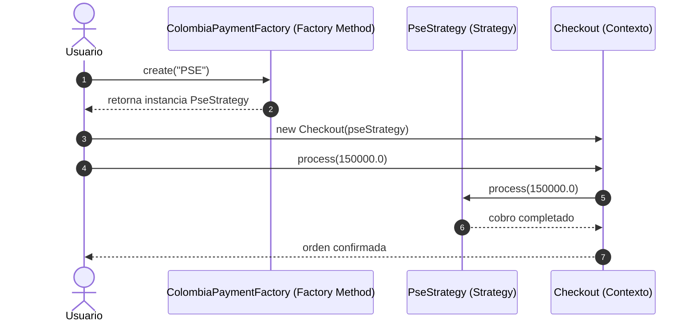

# Ejercicio #01 — Plataforma de Pagos Inteligentes

> **DOSW COMPANY** — *Ejercicios de Refuerzo: Patrones de Diseño Combinados (Multivariable)*  
> **Asignatura:** Desarrollo y Operaciones de Software (DOSW)  
> **Patrones Combinados:** `Strategy` (Comportamiento) + `Factory Method` (Creacional)

---

## 📜 Enunciado del Problema

Una aplicación de e-commerce permite pagar con tarjeta, PSE, Nequi, PayPal y transferencia bancaria. Cada medio tiene una lógica distinta pero el flujo de compra es el mismo. Además, según el país del usuario, el sistema construye el proveedor de pago correcto (Colombia $\to$ PSE/Nequi, USA $\to$ PayPal/Stripe).

---

## 🎯 Patrones de Diseño Combinados y sus Roles

| Patrón | Categoría GoF | Rol Específico en este Escenario |
| :--- | :---: | :--- |
| **Strategy** | **Comportamiento** | Encapsula cada algoritmo y protocolo de pago (`TarjetaStrategy`, `PseStrategy`, `NequiStrategy`, `PaypalStrategy`, `StripeStrategy`) en clases separadas e intercambiables. El contexto `Checkout` procesa la compra operando únicamente contra la abstracción `PaymentStrategy`. |
| **Factory Method** | **Creacional** | Desacopla la creación de las estrategias según la región geográfica del usuario (`ColombiaPaymentFactory`, `UsaPaymentFactory`). Encapsula la lógica de instanciación y parametrización de gateways regionales sin exponer detalles al cliente. |

---

## 🧠 ¿Por qué esta combinación es superior? (Justificación Técnica)

* **Sin Patrones (Antipatrón Monolítico con Condicionales Acoplados):**
  El `Checkout` contendría una matriz gigantesca de `if-else` o `switch` anidados evaluando `if (pais.equals("COL") && metodo.equals("PSE")) ... else if (pais.equals("USA") && metodo.equals("STRIPE")) ...`. Cualquier adición de un nuevo país o medio de pago obligaría a modificar y arriesgar el flujo principal de checkout (violación de SRP y OCP).
* **Con Strategy + Factory Method:**
  Existe una separación limpia de preocupaciones ortogonales:
  1. *Strategy* resuelve **"cómo pagar"** (el algoritmo de cobro).
  2. *Factory Method* resuelve **"quién construye la estrategia adecuada"** (la creación según contexto regional).
  El `Checkout` permanece completamente cerrado a modificaciones (*Open/Closed Principle*).

---

## 🔗 ¿Cómo Interactúan y se Complementan?



1. El usuario selecciona su país y método de pago preferido.
2. La fábrica regional (`PaymentFactory`) instancia la `PaymentStrategy` concreta correspondiente.
3. El `Checkout` recibe la estrategia por inyección de dependencias y ejecuta `process(amount)`.
4. La fábrica decide qué estrategia instanciar; el `Checkout` nunca cambia.

---

## 📐 Esquema de Clases

```text
ejercicio01/
├── PaymentStrategy.java          # [Strategy] Interfaz común de cobro
├── TarjetaStrategy.java          # [Strategy Concreta] Franquicias bancarias
├── PseStrategy.java              # [Strategy Concreta] Débitos ACH Colombia
├── NequiStrategy.java            # [Strategy Concreta] Billetera móvil Colombia
├── PaypalStrategy.java           # [Strategy Concreta] Pasarela internacional PayPal
├── StripeStrategy.java           # [Strategy Concreta] Pasarela internacional Stripe
├── BankTransferStrategy.java     # [Strategy Concreta] Transferencia directa
├── PaymentFactory.java           # [Factory Method] Interfaz creadora
├── ColombiaPaymentFactory.java   # [Factory Concreta] Proveedores válidos en Colombia
├── UsaPaymentFactory.java        # [Factory Concreta] Proveedores válidos en USA
├── Checkout.java                 # Contexto de compra invariante
└── Main.java                     # Suite demostrativa ejecutable
```

---

## 💡 Resumen Clave
> **Pista de Arquitectura:** `Strategy` resuelve el **"cómo procesar la transacción"** mientras que `Factory Method` resuelve el **"quién construye el procesador idóneo"**. Esta combinación elimina el acoplamiento directo entre el cliente de negocio y las concreciones de terceros.

---

## ⚡ Ejecución
```bash
cd semana04/taller4
javac -d bin $(find ejercicio01 -name "*.java")
java -cp bin ejercicio01.Main
```
