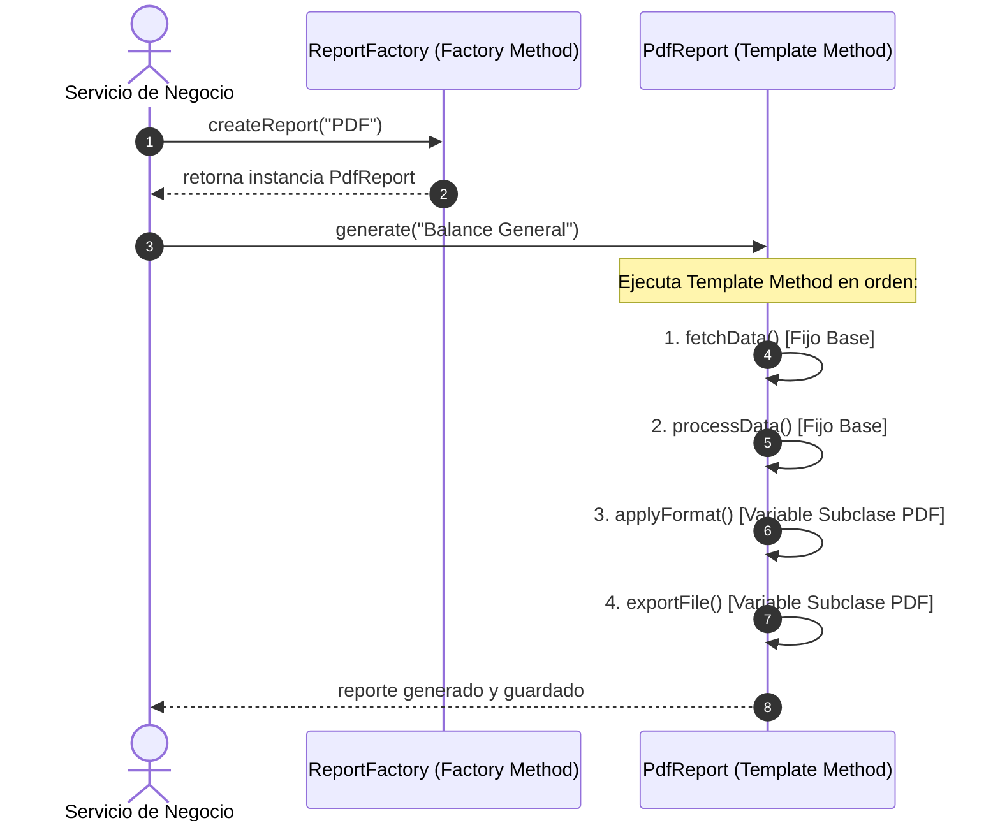

# 📊 Ejercicio #03 — Sistema de Reportes Empresariales

> **DOSW COMPANY** — *Ejercicios de Refuerzo: Patrones de Diseño Combinados (Multivariable)*  
> **Asignatura:** Desarrollo y Operaciones de Software (DOSW)  
> **Patrones Combinados:** `Template Method` (Comportamiento) + `Factory Method` (Creacional)

---

## 📜 Enunciado del Problema

La empresa genera reportes en PDF, Excel y CSV. Todos siguen los mismos 4 pasos:
1. `fetchData()` (Obtener datos de la base de datos).
2. `processData()` (Procesar, filtrar y agregar la información).
3. `applyFormat()` (Aplicar formato visual / estructural).
4. `exportFile()` (Exportar y guardar el archivo físico).

Cada formato implementa *'aplicar formato'* y *'exportar'* de forma diferente. Además, el sistema decide dinámicamente qué tipo de reporte instanciar.

---

## 🎯 Patrones de Diseño Combinados y sus Roles

| Patrón | Categoría GoF | Rol Específico en este Escenario |
| :--- | :---: | :--- |
| **Template Method** | **Comportamiento** | Define el esqueleto invariable del algoritmo en la clase base `ReportGenerator.generate()`, asegurando que los pasos fijos se ejecuten en secuencia obligatoria y delegando a las subclases (`PdfReport`, `ExcelReport`, `CsvReport`) la implementación de los pasos variables. |
| **Factory Method** | **Creacional** | Centraliza la instanciación del generador adecuado (`ReportFactory.createReport()`), permitiendo que el cliente obtenga el objeto polimórfico sin conocer sus constructores concretos. |

---

## 🧠 ¿Por qué esta combinación es superior? (Justificación Técnica)

* **Sin Patrones (Código Duplicado y Algoritmos Desincronizados):**
  Cada clase duplicaría la lógica de conexión a la BD y agregación de métricas. Si cambia la forma de consultar datos, habría que editar 3 o más clases con alto riesgo de olvidar alguna (violación de DRY).
* **Con Template Method + Factory Method:**
  - `Template Method` garantiza la reutilización estricta del flujo común (*Inversión del Control / Principio de Hollywood: "No nos llames, nosotros te llamaremos"*).
  - `Factory Method` elimina el acoplamiento del cliente con las clases hijas.

---

## 🔗 ¿Cómo Interactúan y se Complementan?



---

## 📐 Esquema de Clases

```text
ejercicio03/
├── ReportGenerator.java           # [Template Method] Clase base abstracta con generate() final
├── PdfReport.java                 # [Subclase Concreta] Implementa applyFormat() y exportFile()
├── ExcelReport.java               # [Subclase Concreta] Implementa applyFormat() y exportFile()
├── CsvReport.java                 # [Subclase Concreta] Implementa applyFormat() y exportFile()
├── ReportFactory.java             # [Factory Method] Creador dinámico de generadores
└── Main.java                      # Suite demostrativa ejecutable
```

---

## 💡 Resumen Clave
> **Diferencia Clave:** `Template Method` = *"el esqueleto es fijo, los detalles varían"*. `Strategy` = *"el algoritmo completo es intercambiable"*. Cuando un proceso tiene pasos fijos compartidos y pasos variables, `Template Method` es el patrón canónico superior.

---

## ⚡ Ejecución
```bash
cd semana04/taller4
javac -d bin $(find ejercicio03 -name "*.java")
java -cp bin ejercicio03.Main
```
