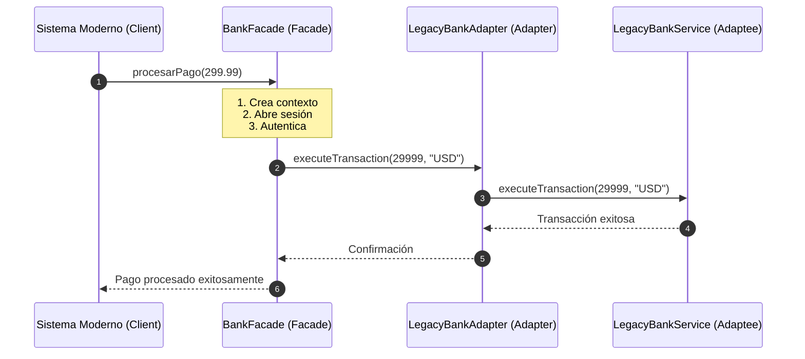

# 🔔 Ejercicio #05 — Integración Legacy con Adapter y Facade

> **DOSW COMPANY** — *Ejercicios de Refuerzo: Patrones de Diseño Combinados (Multivariable)*  
> **Asignatura:** Desarrollo y Operaciones de Software (DOSW)  
> **Patrones Combinados:** `Adapter` (Estructural) + `Facade` (Creacional)

---

## 📜 Enunciado del Problema

Se debe integrar un sistema de pagos moderno con un servicio bancario heredado (Legacy) que tiene una interfaz incompatible y requiere   un proceso de inicialización complejo (múltiples pasos de configuración).  
El objetivo es usar el Adapter para traducir el lenguaje del sistema moderno al legacy y la Facade para ocultar la complejidad de la inicialización.

---

## 🎯 Patrones de Diseño Combinados y sus Roles

| Patrón | Categoría GoF | Rol Específico en este Escenario |
| :--- | :---: | :--- |
| **Adapter** | **Estructural** | Se encarga exclusivamente de adaptar o "traducir" el lenguaje de nuestro dominio moderno (ej. montos en decimales) al lenguaje que entiende el sistema Legacy (ej. montos en centavos). |
| **Facade** | **Creacional** | Oculta la complejidad de la inicialización de la infraestructura antigua. Encapsula los múltiples pasos de configuración (`initContext`, `openSession`) detrás de una interfaz limpia. |

---

## 🧠 ¿Por qué esta combinación es superior? (Justificación Técnica)

* **Sin Patrones:**
  Tendríamos que llamar a múltiples métodos de inicialización directamente en nuestro código de negocio (Spaghetti Code) y manejar manualmente las conversiones de tipo de dato, acoplando nuestra lógica limpia a la suciedad de la infraestructura legacy.
* **Con Adapter + Facade:**
  Existe una separación ortogonal de responsabilidades:
  1. *Facade* resuelve **"cómo inicializar la infraestructura"** (escondiendo pasos tediosos).
  2. *Adapter* resuelve **"cómo comunicar"** (traduciendo el contrato de métodos).
  Esta combinación es crucial cuando se migra o integra con sistemas heredados, permitiendo un cambio gradual y seguro.

---

## 🔗 ¿Cómo Interactúan y se Complementan?



---

## 📐 Esquema de Clases

```text
ejercicio05/
├── PaymentProcessor.java         # Interfaz de pago moderna (Cliente)
├── BankFacade.java             # [Facade] Orquestador de inicialización
├── LegacyBankAdapter.java        # [Adapter] Traduce del cliente al legacy
├── LegacyBankService.java        # [Adaptee] Servicio bancario antiguo (externo)
└── Main.java                   # Suite demostrativa ejecutable
```

---

## 💡 Resumen Clave
> **Pista de Arquitectura:** `Facade` simplifica la interacción inicial con sistemas complejos, mientras que `Adapter` permite que el código moderno "hable" con interfaces antiguas sin modificarlas.

---

## ⚡ Ejecución
```bash
cd semana04/taller4
javac -d bin $(find ejercicio05 -name "*.java")
java -cp bin ejercicio05.Main
```