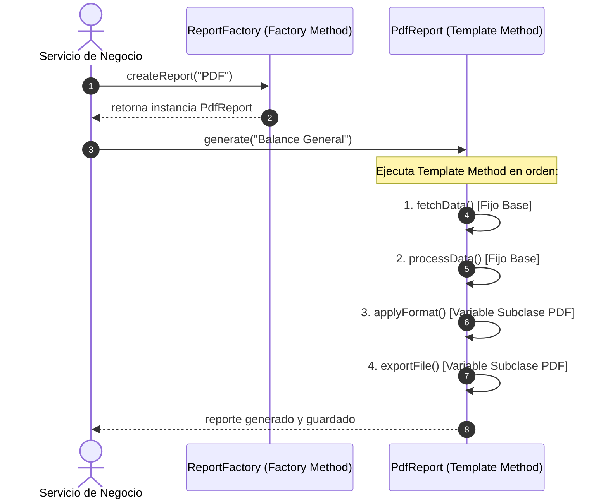

# 📊 Ejercicio #07 — Aprobación Documental (Chain of Responsibility + State)

> **DOSW COMPANY** — *Ejercicios de Refuerzo: Patrones de Diseño Combinados (Multivariable)*  
> **Asignatura:** Desarrollo y Operaciones de Software (DOSW)  
> **Patrones Combinados:** `Chain of Responsibility` (Comportamiento) + `State` (Creacional)

---

## 📜 Enunciado del Problema

Un documento pasa por múltiples validadores dinámicos (Autor, Líder, Jurídico, Financiero) antes de ser aprobado. Cada validador es un   eslabón independiente y el documento transiciona por distintos estados internos (Borrador, En Revisión, Aprobado, Rechazado), cambiando su comportamiento según su estado actual, todo sin usar sentencias condicionales masivas.

---

## 🎯 Patrones de Diseño Combinados y sus Roles

| Patrón | Categoría GoF | Rol Específico en este Escenario |
| :--- | :---: | :--- |
| **Chain of Responsibility** | **Comportamiento** | Define y encadena a los revisores (`Autor`, `Líder`, `Jurídico`, `Financiero`) como eslabones independientes. Cada eslabón (`Handler`) decide si procesa el documento o lo pasa al siguiente en la cadena, permitiendo configurar rutas de aprobación dinámicas según el tipo de documento. |
| **State** | **Comportamiento** | Encapsula el ciclo de vida y las reglas de transición del documento (`DraftState`, `InReviewState`, `ApprovedState`, `RejectedState`). Cada estado es una clase independiente que sabe a qué estado puede avanzar, delegando las acciones (`approve()`, `reject()`) y eliminando por completo los `switch(estado)` dentro de la clase `Document`. |

---

## 🧠 ¿Por qué esta combinación es superior? (Justificación Técnica)

* **Sin Patrones (Código Desincronizado y Lógica Compactada):**
  El `Document` contendría un `switch` con todos los estados y, dentro de cada estado, una estructura `if-else` para cada validador. Si se agrega un nuevo revisor o estado, habría que editar múltiples `switch` en diferentes métodos, haciendo el código frágil y difícil de mantener (violación de Open/Closed Principle y SRP).
* **Con Chain of Responsibility + State:**
  - `Chain of Responsibility` permite configurar rutas de aprobación dinámicas sin modificar el código de los validadores o el documento.
  - `State` elimina por completo el `switch(estado)` dentro del documento, haciendo que cada estado sea responsable únicamente de sus propias transiciones y comportamientos.

---

## 🎯 Patrones de Diseño Combinados y sus Roles

| Patrón | Categoría GoF | Rol Específico en este Escenario |
| :--- | :---: | :--- |
| **Template Method** | **Comportamiento** | Define el esqueleto invariable del algoritmo en la clase base `ReportGenerator.generate()`, asegurando que los pasos fijos se ejecuten en secuencia obligatoria y delegando a las subclases (`PdfReport`, `ExcelReport`, `CsvReport`) la implementación de los pasos variables. |
| **Factory Method** | **Creacional** | Centraliza la instanciación del generador adecuado (`ReportFactory.createReport()`), permitiendo que el cliente obtenga el objeto polimórfico sin conocer sus constructores concretos. |

---

## 🧠 ¿Por qué esta combinación es superior? (Justificación Técnica)

* **Sin Patrones (Código Duplicado y Algoritmos Desincronizados):**
  Cada clase duplicaría la lógica de conexión a la BD y agregación de métricas. Si cambia la forma de consultar datos, habría que editar 3 o más clases con alto riesgo de olvidar alguna (violación de DRY).
* **Con Template Method + Factory Method:**
  - `Template Method` garantiza la reutilización estricta del flujo común (*Inversión del Control / Principio de Hollywood: "No nos llames, nosotros te llamaremos"*).
  - `Factory Method` elimina el acoplamiento del cliente con las clases hijas.

---

## 🔗 ¿Cómo Interactúan y se Complementan?



---

## 📐 Esquema de Clases

```text
ejercicio03/
├── ReportGenerator.java           # [Template Method] Clase base abstracta con generate() final
├── PdfReport.java                 # [Subclase Concreta] Implementa applyFormat() y exportFile()
├── ExcelReport.java               # [Subclase Concreta] Implementa applyFormat() y exportFile()
├── CsvReport.java                 # [Subclase Concreta] Implementa applyFormat() y exportFile()
├── ReportFactory.java             # [Factory Method] Creador dinámico de generadores
└── Main.java                      # Suite demostrativa ejecutable
```

---

## 💡 Resumen Clave
> **Diferencia Clave:** `Template Method` = *"el esqueleto es fijo, los detalles varían"*. `Strategy` = *"el algoritmo completo es intercambiable"*. Cuando un proceso tiene pasos fijos compartidos y pasos variables, `Template Method` es el patrón canónico superior.

---

## ⚡ Ejecución
    ```bash
cd semana04/taller4
javac -d bin $(find ejercicio03 -name "*.java")
java -cp bin ejercicio03.Main
```